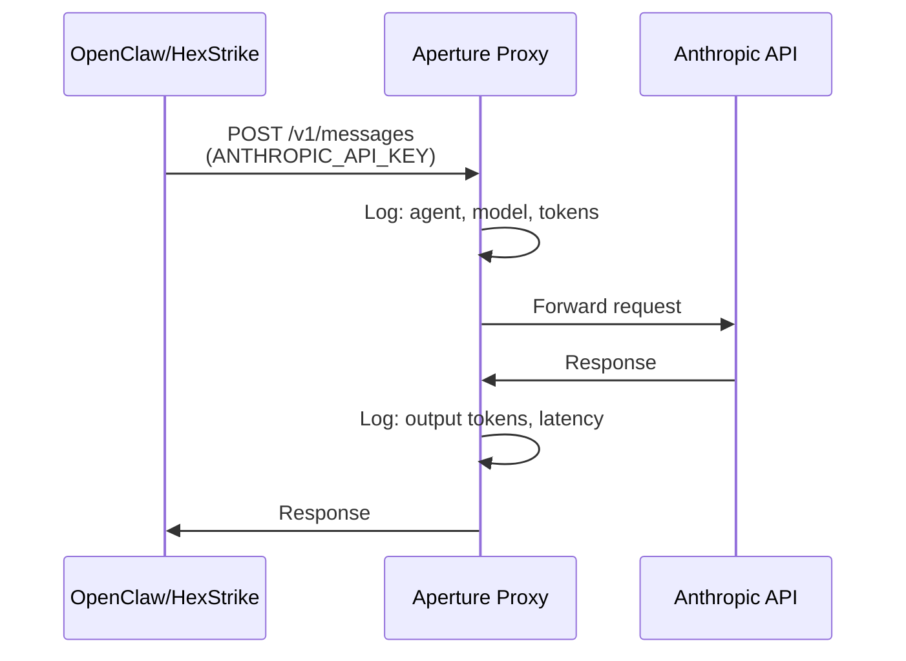

# Aperture Integration

Aperture is the LLM API proxy that provides identity-aware token attribution for all agent API calls. Every Claude API call from OpenClaw and HexStrike routes through Aperture before reaching Anthropic.

## How It Works

## Token Attribution

Every API call is attributed to:
- **Agent identity**: Which agent made the call (openclaw, hexstrike)
- **Campaign context**: Which campaign triggered the call
- **Model**: Which Claude model was used (sonnet, opus)
- **Token counts**: Input and output tokens

## Data Flow

1. **Real-time**: Aperture sends webhook events to rj-gateway (`/aperture/webhook`)
2. **Batch**: Aperture exports usage data to S3 (`s3://fuzzy-models/aperture/exports/`)
3. **Ingestion**: rj-gateway polls S3 every 15 minutes and backfills MeterStore
4. **Metering**: MeterStore aggregates by agent + campaign, flushes to Setec hourly

## Gateway Tools

| Tool | Description |
|------|-------------|
| `juggler_aperture_usage` | Query token usage by agent, campaign, or model |
| `juggler_campaign_status` | Campaign results with Aperture flow metadata |

## Configuration

| Variable | Description | Default |
|----------|-------------|---------|
| `ANTHROPIC_BASE_URL` | Set on agents to route through Aperture | `http://aperture.fuzzy-dev.svc.cluster.local` |
| `RJ_GATEWAY_APERTURE_URL` | Aperture URL for health checks | -- |
| `RJ_GATEWAY_APERTURE_S3_*` | S3 bucket config for export ingestion | -- |
| `RJ_GATEWAY_WEBHOOK_SECRET` | HMAC secret for webhook authentication | -- |

## Audit Trail

Audit entries for all credential access events are:
1. Logged to stdout (structured JSON)
2. Stored in an in-memory ring buffer (1000 entries)
3. Exported to S3 in NDJSON format every 5 minutes (`audit/{date}/audit-{ts}.ndjson`)
4. Queryable via `/audit` endpoint and `juggler_audit_log` MCP tool
