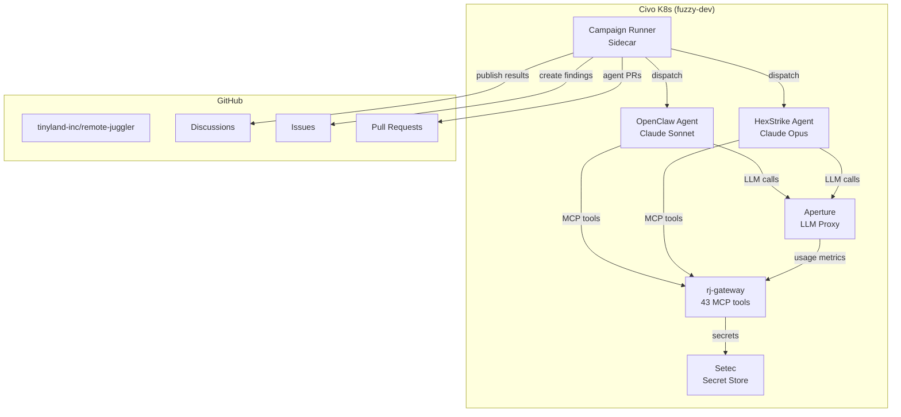

# Agent Ecosystem

RemoteJuggler includes a fully operational agent plane that autonomously maintains, monitors, and secures the repository. Three AI agents -- **OpenClaw**, **HexStrike**, and **Claude Code** -- run campaigns through a shared MCP gateway, with results published publicly to GitHub Discussions.

## Architecture

## Agents

| Agent | Model | Role | Replicas |
|-------|-------|------|----------|
| **OpenClaw** | Claude Sonnet | General-purpose analysis, dependency audits, issue triage | 1 |
| **HexStrike** | Claude Opus | Security scanning, CVE monitoring, credential exposure | 0 (on-demand) |
| **Claude Code** | Direct MCP | Gateway health checks, MCP regression testing | N/A (tools only) |

## Campaign Runner

The campaign runner is a Go sidecar in the OpenClaw pod that orchestrates all campaign execution:

- **Trigger evaluation**: Cron schedules, webhook events, manual triggers, dependency chains
- **Agent dispatch**: Routes campaigns to the appropriate agent (OpenClaw, HexStrike, or direct MCP)
- **Result collection**: Stores results in Setec with timestamped history
- **Feedback**: Creates/closes GitHub issues based on findings
- **Publishing**: Posts sanitized results to GitHub Discussions
- **Kill switch**: Global emergency halt via Setec key

## Live Status

<!-- AGENT-STATUS:START -->
### Agent Ecosystem Status

Last updated: 2026-02-26 07:35 UTC

| Campaign | Agent | Last Run | Status | Key Metric |
|----------|-------|----------|--------|------------|
| Gateway Health | claude-code | <1h ago | PASS | -- |
| Dependency Audit | openclaw | -- | -- | -- |
| Credential Scan | hexstrike | -- | -- | -- |
| Gateway Smoketest | openclaw | -- | -- | -- |
| MCP Regression | claude-code | -- | -- | -- |
| Audit Completeness | cross-agent | -- | -- | -- |

*View all reports in [Discussions](https://github.com/tinyland-inc/remote-juggler/discussions)*
<!-- AGENT-STATUS:END -->

## Security Model

1. **No secrets in public output**: All Discussion posts are sanitized (regex + entropy + URL patterns)
2. **Budget enforcement**: Every campaign has `aiApiBudget.maxTokens`
3. **Read-only default**: All campaigns are `readOnly: true` unless explicitly opted out
4. **Kill switch**: `remotejuggler/campaigns/global-kill` in Setec halts all campaigns
5. **Approval gates**: Security findings create issues; humans decide action
