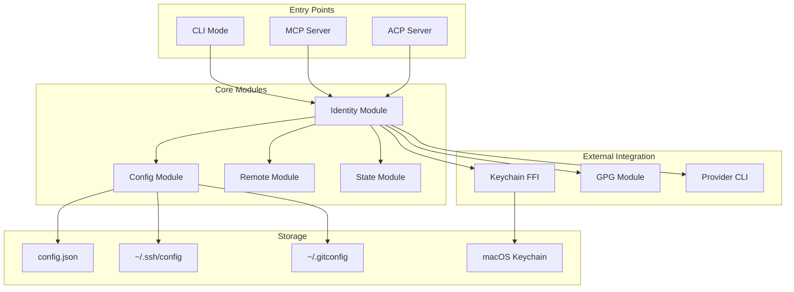
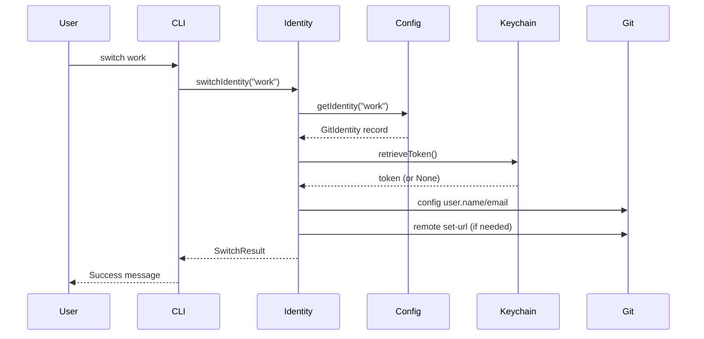
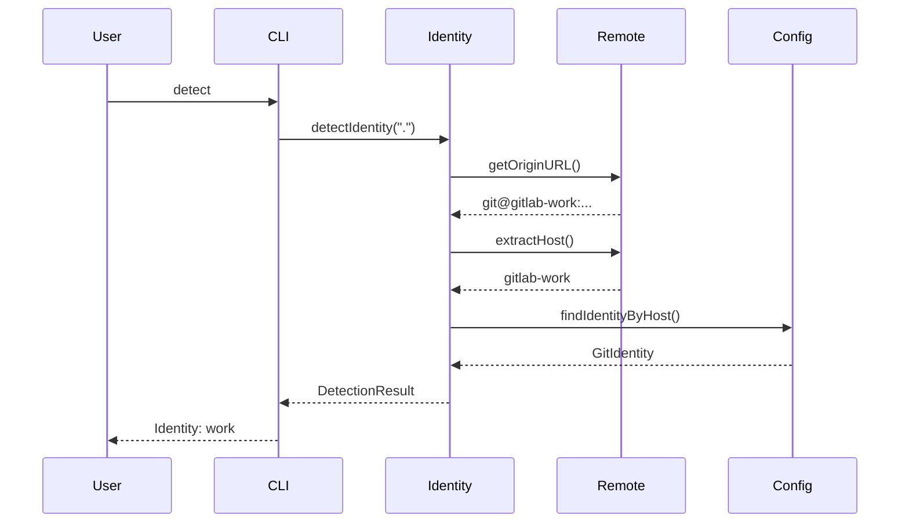

# Architecture

RemoteJuggler is built in Chapel, a high-performance programming language designed for parallel computing and productivity.

## Design Principles

1. **Single Binary**: No runtime dependencies, static linking
2. **Protocol Agnostic**: Same core logic for CLI, MCP, and ACP
3. **Secure by Default**: Keychain integration, no plaintext tokens
4. **Provider Abstraction**: Unified interface for GitLab, GitHub, Bitbucket

## System Overview



## Module Responsibilities

| Module | Responsibility |
|--------|---------------|
| `Core` | Type definitions, enums, common helpers |
| `Config` | SSH and gitconfig parsing |
| `GlobalConfig` | Configuration file management |
| `State` | Runtime state persistence |
| `Identity` | Identity operations and switching |
| `Remote` | Git remote URL manipulation |
| `Keychain` | macOS Security.framework FFI |
| `GPG` | GPG key management |
| `ProviderCLI` | glab/gh CLI integration |
| `Protocol` | JSON-RPC base protocol |
| `MCP` | Model Context Protocol server |
| `ACP` | Agent Communication Protocol server |
| `Tools` | MCP/ACP tool definitions |

## Data Flow

### Identity Switch Flow



### Detection Flow



## Threading Model

RemoteJuggler uses Chapel's task parallelism conservatively:

- **CLI Mode**: Single-threaded, synchronous operations
- **MCP/ACP Mode**: Single-threaded event loop (STDIO protocol)
- **Subprocess Calls**: Blocking subprocess spawns

No explicit parallelism is used to ensure predictable behavior for configuration operations.

## Error Handling

Chapel 2.7+ uses prototype module declarations to enable fatal error handling:

```chapel
prototype module ModuleName {
  // Unhandled errors are fatal
}
```

All modules use this pattern to avoid silent failures.

## Security Model

### Token Storage

1. **macOS Keychain**: Primary storage via Security.framework
2. **Environment Variables**: Fallback for non-Darwin platforms
3. **No Plaintext**: Tokens never written to config files

### SSH Key Access

SSH keys remain in `~/.ssh/` with standard Unix permissions. RemoteJuggler only references key paths, never reads private key content.

### Git Configuration

Git user.name and user.email are modified through `git config` commands, not direct file manipulation.

## Further Reading

- [Chapel Modules](modules.md) - Detailed module documentation
- [Keychain Integration](keychain.md) - macOS Security.framework FFI
- [Protocol Specifications](protocols.md) - MCP/ACP wire format
