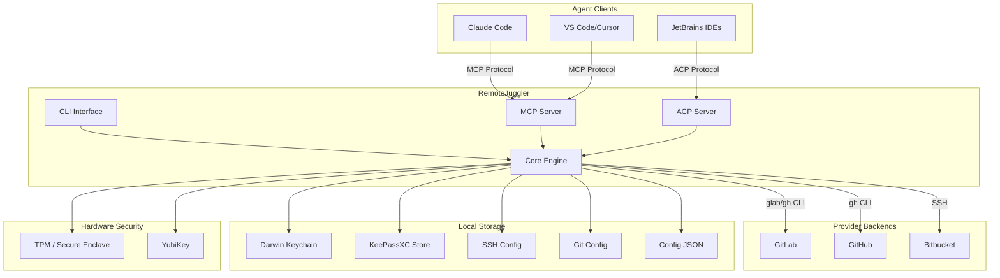

# RemoteJuggler

Backend-agnostic git identity management with MCP/ACP agent protocol support.

RemoteJuggler enables seamless switching between multiple git identities across GitLab, GitHub, and Bitbucket. Built in Chapel for high performance, it integrates with AI coding assistants via Model Context Protocol (MCP) and Agent Communication Protocol (ACP).

## Architecture Overview



## Key Features

- **Multi-Provider Support**: GitLab (including self-hosted), GitHub, Bitbucket
- **SSH Alias Management**: Automatic SSH config host alias handling
- **Credential Security**: macOS Keychain integration, KeePassXC credential authority
- **Hardware Security**: TPM/Secure Enclave + YubiKey support, trusted workstation mode
- **GPG Signing**: Per-identity GPG key configuration
- **Agent Protocols**: MCP server (36 tools) for Claude Code/Cursor/VS Code, ACP for JetBrains
- **Zero Dependencies**: Single static binary, no runtime requirements

## Quick Start

```bash
# Install via script
curl -sSL https://gitlab.com/tinyland/projects/remote-juggler/-/raw/main/install.sh | bash

# Import existing SSH config
remote-juggler config import

# List detected identities
remote-juggler list

# Switch identity
remote-juggler switch gitlab-work
```

## Integration with AI Assistants

RemoteJuggler exposes identity management through standardized protocols:

=== "Claude Code (MCP)"

    ```json
    {
      "mcpServers": {
        "remote-juggler": {
          "command": "remote-juggler",
          "args": ["--mode=mcp"]
        }
      }
    }
    ```

=== "JetBrains (ACP)"

    ```json
    {
      "acpServers": {
        "remote-juggler": {
          "command": "remote-juggler",
          "args": ["--mode=acp"]
        }
      }
    }
    ```

## Source Code

The implementation consists of 20 Chapel modules in `src/remote_juggler/`:

| Module | Purpose |
|--------|---------|
| `Core.chpl` | Type definitions, version, enums |
| `Config.chpl` | Configuration management |
| `GlobalConfig.chpl` | Schema versioning |
| `State.chpl` | State persistence |
| `Identity.chpl` | Identity switching |
| `Remote.chpl` | Remote URL management |
| `Keychain.chpl` | macOS Keychain integration |
| `GPG.chpl` | GPG signing |
| `ProviderCLI.chpl` | Provider CLI wrappers (glab/gh) |
| `Protocol.chpl` | JSON-RPC protocol |
| `MCP.chpl` | MCP server |
| `ACP.chpl` | ACP server |
| `Tools.chpl` | MCP/ACP tool definitions (36 tools) |
| `HSM.chpl` | TPM/Secure Enclave integration |
| `YubiKey.chpl` | YubiKey management |
| `TrustedWorkstation.chpl` | Auto-unlock mode |
| `GPGAgent.chpl` | GPG agent integration |
| `TokenHealth.chpl` | Token expiry detection |
| `Setup.chpl` | Interactive setup wizard |
| `KeePassXC.chpl` | Credential authority |

See [Architecture](architecture/index.md) for detailed module documentation.

## License

zlib License. See [LICENSE](https://gitlab.com/tinyland/projects/remote-juggler/-/blob/main/LICENSE) for details.
