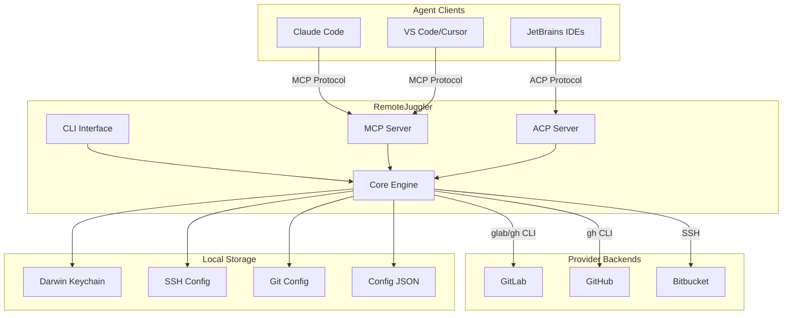

# RemoteJuggler

Backend-agnostic git identity management with MCP/ACP agent protocol support.

RemoteJuggler enables seamless switching between multiple git identities across GitLab, GitHub, and Bitbucket. Built in Chapel for high performance, it integrates with AI coding assistants via Model Context Protocol (MCP) and Agent Communication Protocol (ACP).

## Architecture Overview



## Key Features

- **Multi-Provider Support**: GitLab (including self-hosted), GitHub, Bitbucket
- **SSH Alias Management**: Automatic SSH config host alias handling
- **Credential Security**: macOS Keychain integration for secure token storage
- **GPG Signing**: Per-identity GPG key configuration
- **Agent Protocols**: MCP server for Claude Code, ACP server for JetBrains
- **Zero Dependencies**: Single static binary, no runtime requirements

## Quick Start

```bash
# Install via script
curl -sSL https://gitlab.com/tinyland/projects/remote-juggler/-/raw/main/install.sh | bash

# Import existing SSH config
remote-juggler config import

# List detected identities
remote-juggler list

# Switch identity
remote-juggler switch gitlab-work
```

## Integration with AI Assistants

RemoteJuggler exposes identity management through standardized protocols:

=== "Claude Code (MCP)"

    ```json
    {
      "mcpServers": {
        "remote-juggler": {
          "command": "remote-juggler",
          "args": ["--mode=mcp"]
        }
      }
    }
    ```

=== "JetBrains (ACP)"

    ```json
    {
      "acpServers": {
        "remote-juggler": {
          "command": "remote-juggler",
          "args": ["--mode=acp"]
        }
      }
    }
    ```

## Source Code

The implementation consists of 14 Chapel modules in `src/remote_juggler/`:

| Module | Purpose | Lines |
|--------|---------|-------|
| `Core.chpl` | Type definitions, enums | ~150 |
| `Config.chpl` | SSH/Git config parsing | ~200 |
| `Identity.chpl` | Identity operations | ~300 |
| `Keychain.chpl` | macOS Security.framework FFI | ~100 |
| `MCP.chpl` | Model Context Protocol server | ~250 |
| `Tools.chpl` | MCP tool definitions | ~200 |

See [Architecture](architecture/index.md) for detailed module documentation.

## License

MIT License. See [LICENSE](https://gitlab.com/tinyland/projects/remote-juggler/-/blob/main/LICENSE) for details.
