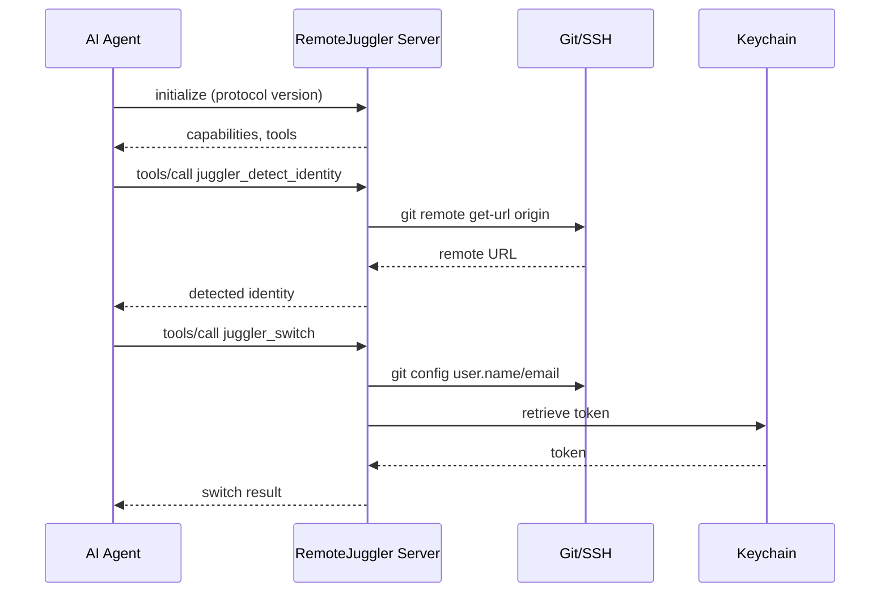

# Integrations

RemoteJuggler integrates with AI coding assistants through standardized protocols.

## Protocol Support

| Protocol | Target | Transport | Status |
|----------|--------|-----------|--------|
| MCP | Claude Code, VS Code, Cursor | STDIO | Stable |
| ACP | JetBrains IDEs | STDIO | Stable |

## Architecture



## Available Tools

All integrations expose the same set of tools (see `src/remote_juggler/Tools.chpl:52-209`):

| Tool | Description |
|------|-------------|
| `juggler_list_identities` | List configured identities |
| `juggler_detect_identity` | Detect identity for repository |
| `juggler_switch` | Switch to identity |
| `juggler_status` | Get current status |
| `juggler_validate` | Validate connectivity |
| `juggler_store_token` | Store token in Keychain |
| `juggler_sync_config` | Sync configuration |

## Integration Options

### User-Level Configuration

Configure RemoteJuggler globally for all projects:

=== "Claude Code"

    `~/.claude/mcp.json`:
    ```json
    {
      "mcpServers": {
        "remote-juggler": {
          "command": "remote-juggler",
          "args": ["--mode=mcp"]
        }
      }
    }
    ```

=== "JetBrains"

    `~/.jetbrains/acp.json`:
    ```json
    {
      "agent_servers": {
        "RemoteJuggler": {
          "command": "remote-juggler",
          "args": ["--mode=acp"]
        }
      }
    }
    ```

### Project-Level Configuration

Configure RemoteJuggler for a specific project:

`.mcp.json` in project root:
```json
{
  "mcpServers": {
    "remote-juggler": {
      "command": "remote-juggler",
      "args": ["--mode=mcp"]
    }
  }
}
```

## Protocol Documentation

- [MCP Server](mcp.md) - Model Context Protocol integration
- [ACP Server](acp.md) - Agent Communication Protocol integration
- [Editor Setup](editors.md) - VS Code, Cursor, and other editors
