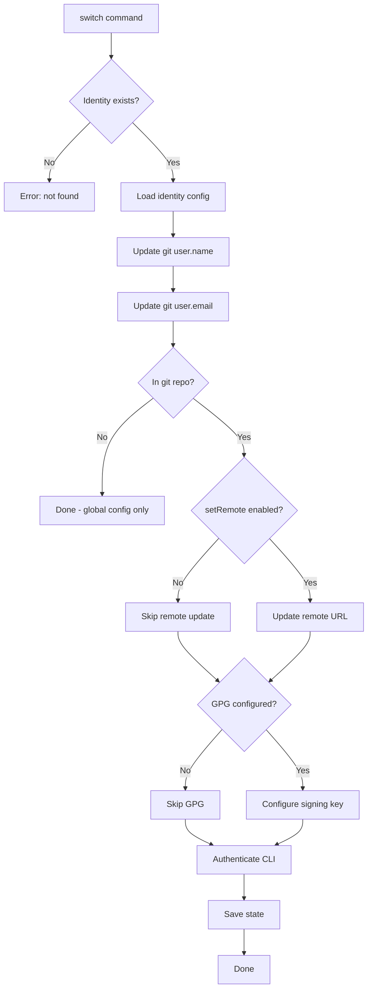
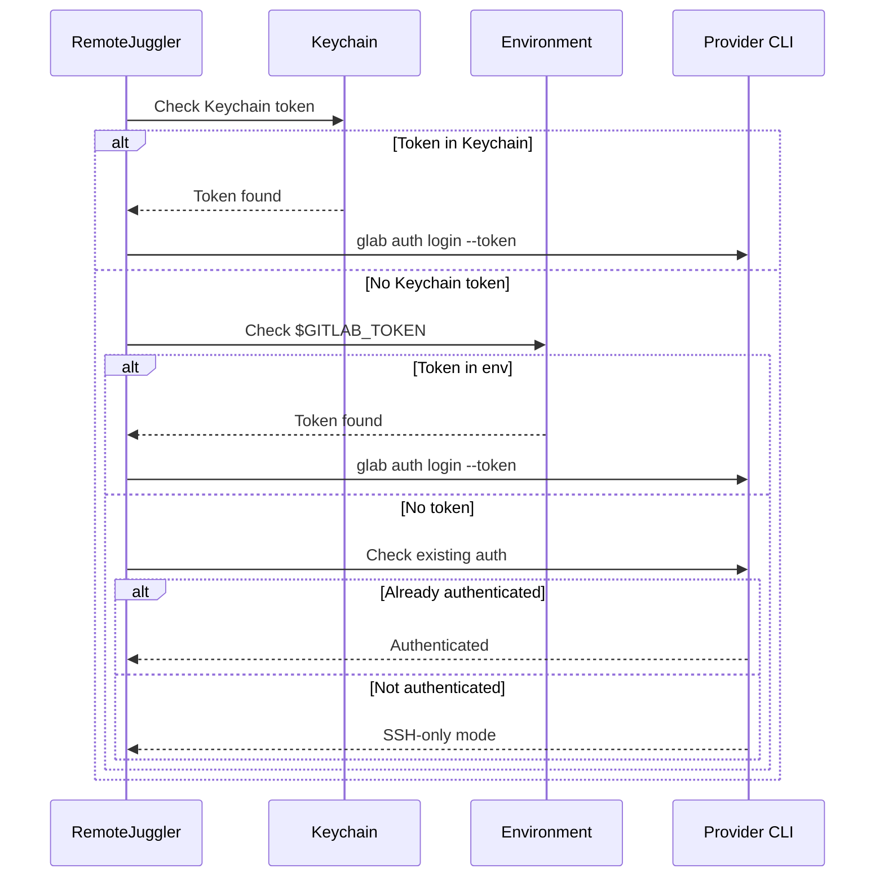

# Identity Switching

Detailed guide for switching between git identities.

## Switch Workflow



## Basic Switching

### Switch to Named Identity

```bash
remote-juggler switch work
```

Actions performed:
1. Load identity configuration for "work"
2. Set `git config user.name` to identity's user
3. Set `git config user.email` to identity's email
4. Update remote URL if in a git repository
5. Configure GPG signing key if configured
6. Authenticate with provider CLI if token available

### Using the Alias

The `to` command is an alias for `switch`:

```bash
remote-juggler to personal
```

## Switching Options

### Without Remote Update

Keep the existing remote URL:

```bash
remote-juggler switch work --setRemote=false
```

Use case: Testing with a different identity without modifying the repository.

### Without GPG Configuration

Skip GPG signing setup:

```bash
remote-juggler switch work --gpgSign=false
```

Use case: Quick switch when GPG isn't needed.

## Remote URL Transformation

When switching identities, remote URLs are transformed to use the appropriate SSH host alias.

### Before Switch

```
origin  git@gitlab-personal:user/repo.git (fetch)
origin  git@gitlab-personal:user/repo.git (push)
```

### After Switch to Work

```
origin  git@gitlab-work:user/repo.git (fetch)
origin  git@gitlab-work:user/repo.git (push)
```

### Transformation Logic

| Original Host | Target Identity | New Host |
|--------------|-----------------|----------|
| gitlab.com | work | gitlab-work |
| gitlab-personal | work | gitlab-work |
| github.com | github-oss | github.com |
| gitlab-work | personal | gitlab-personal |

## Authentication Flow



## Multiple Repositories

### Switching Affects Current Directory

The switch command configures the repository in the current directory:

```bash
cd ~/work/project-a
remote-juggler switch work
# project-a now uses work identity

cd ~/personal/project-b
remote-juggler switch personal
# project-b now uses personal identity

cd ~/work/project-a
remote-juggler status
# Shows: work (unchanged)
```

### Global vs Local Configuration

- **Global**: `~/.gitconfig` user.name and user.email
- **Local**: `.git/config` in each repository

RemoteJuggler updates local config when in a git repository, global config otherwise.

## Detecting Current Identity

### From Repository Context

```bash
cd ~/projects/work-repo
remote-juggler detect
```

Detection uses:
1. Remote URL SSH host alias
2. Organization path patterns
3. Configured identity mappings

### Manual Status Check

```bash
remote-juggler status
```

Shows:
- Current identity name
- Provider
- User and email
- GPG configuration
- Repository context
- Last switch time

## Automation Examples

### Git Hook for Auto-Switch

`.git/hooks/post-checkout`:

```bash
#!/bin/bash
# Auto-switch identity after checkout

detected=$(remote-juggler detect --quiet 2>/dev/null)
current=$(remote-juggler status --quiet 2>/dev/null)

if [ -n "$detected" ] && [ "$detected" != "$current" ]; then
    echo "Auto-switching to identity: $detected"
    remote-juggler switch "$detected"
fi
```

### Shell Prompt Integration

Add identity to prompt (bash):

```bash
remote_juggler_identity() {
    remote-juggler status --quiet 2>/dev/null || echo "none"
}

PS1='[\u@\h $(remote_juggler_identity)] \W$ '
```

### direnv Integration

`.envrc` in project:

```bash
# Auto-switch when entering directory
layout git
remote-juggler switch work
```

## Troubleshooting

### "Identity not found"

The requested identity doesn't exist in configuration:

```bash
# List available identities
remote-juggler list

# Import from SSH config
remote-juggler config import
```

### "Remote URL update failed"

The repository may not have a remote named "origin":

```bash
# Check remotes
git remote -v

# Add origin if missing
git remote add origin git@gitlab-work:company/repo.git
```

### "GPG key not found"

The identity's GPG key isn't available:

```bash
# Check available keys
gpg --list-secret-keys

# Skip GPG for this switch
remote-juggler switch work --gpgSign=false
```
