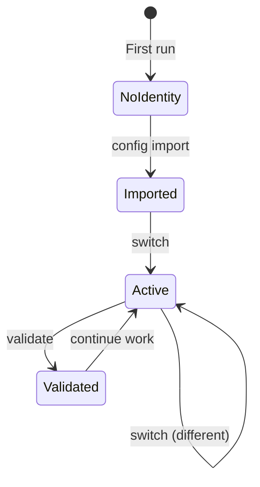

# Operations

Day-to-day usage patterns for RemoteJuggler.

## Common Workflows

### Starting a New Project

1. Clone the repository
2. Detect the appropriate identity
3. Switch if needed

```bash
git clone git@gitlab-work:company/project.git
cd project
remote-juggler detect
remote-juggler switch work
```

### Switching Contexts

When moving between work and personal projects:

```bash
# Check current identity
remote-juggler status

# Switch to personal
remote-juggler switch personal

# Verify
remote-juggler status
```

### Validating Setup

Before important operations (merge requests, releases):

```bash
remote-juggler validate work
```

## Identity States



## Best Practices

### One Identity Per Session

Switch identity at the start of a work session, not per-operation:

```bash
# Good: Switch once
remote-juggler switch work
git commit -m "Feature"
git push

# Avoid: Switching per operation
remote-juggler switch work
git commit
remote-juggler switch personal
git push  # Wrong identity!
```

### Use Detection in Scripts

For automation, use detection rather than hardcoded identities:

```bash
#!/bin/bash
cd "$PROJECT_DIR"
identity=$(remote-juggler detect --quiet)
remote-juggler switch "$identity"
```

### Validate Before Important Operations

```bash
# Before creating merge request
remote-juggler validate work
glab mr create
```

## Detailed Guides

- [Identity Switching](identity-switching.md) - Advanced switching workflows
- [SSH Configuration](ssh-config.md) - SSH host alias management
- [GPG Signing](gpg-signing.md) - Commit and tag signing
- [Troubleshooting](troubleshooting.md) - Common issues and fixes
